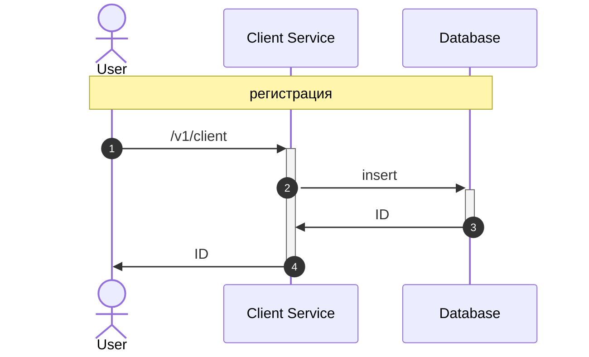
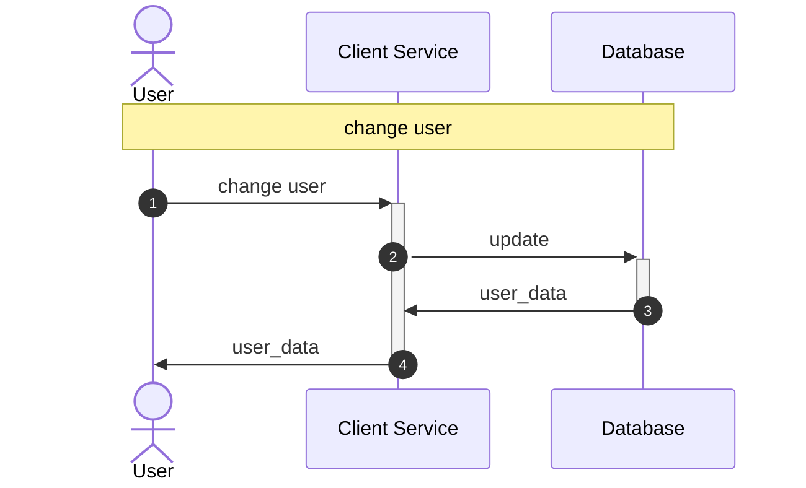
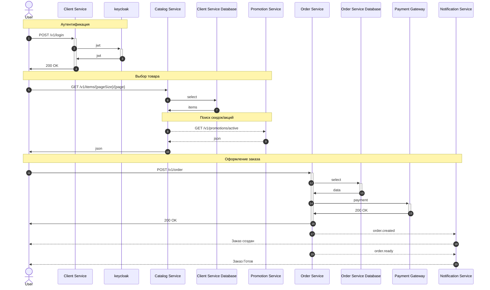

# Паттерны декомпозиции микросервисов

### Постановка задачи

В качестве архитектурной задачи возьмем кейс интернет-магазина.
Ката I'll Have the BLT.

**Задание:**
Выполнить разбиение архитектурной задачи на несколько микросервисов с учётом возможных изменений и масштабирования системы.

**Что требуется:**
1. Пользовательские сценарии.
2. Схему взаимодействия сервисов – C4 model контейнерная диаграмма (см. ссылки на доп.источники по C4 model ниже).
   Описание каждого микросервиса по одному из шаблонов на выбор (в материалах занятия), включая:
3. Для каждого микросервиса опишите его назначение и зону ответственности.
4. Опишите контракты взаимодействия микросервисов друг с другом.

---

## Краткий обзор решения

В решении предложена **микросервисная архитектура** с разбиением на 4 основных сервисов:

| Сервис                   |  Зона ответственности |
|--------------------------|---------------------|
| **order service**        | Управление заказами |
| **promotion service**    | Акции и скидки |
| **client service**       | Профили клиентов |
| **notification service** | Уведомления |
| **catalog service**      |  Каталог товаров  |

**Взаимодействие:**
- **Синхронное (REST)** — для критичных операций
- **Асинхронное (RabbitMQ)** — для уведомлений и интеграции

---

## 1. Пользовательские сценарии
* Пользователь регистрируется в магазине
* Пользователь проходит аутентификацию
* Пользователь осуществляет поиск в каталоге товаров
* Пользователь формирует корзину
  * Добавляет товар
  * Удаляет товар
  * Изменяет количество единиц товара
  * Имеет возможность просмотреть корзину
  * Имеет возможность очистить корзину
* Пользователь оформляет заказ
  * Выбирает адрес доставки
  * Получает данные о времени доставки
  * Выбирает время доставки
  * Подтверждает заказ
* Пользователь оплачивает заказ
* Пользователь может отменить заказ

---

## 2. Схема взаимодействия микросервисов







## 3. Описание микросервисов
### 3.1 Сервис Управление клиентами
Назначение: Управление профилями и данными клиентов

| Параметр                 | Значение                                                              |
|--------------------------|-----------------------------------------------------------------------| 
| **Зона ответственности** | Регистрация, профили, сохранённые адреса, история заказов, предпочтения |
| **API операции**         | GET /v1/client/{id} , POST /v1/client, PATCH /v1/client/{id}/profile     |

### 3.2 Сервис Управление заказами
Назначение: Управление полным жизненным циклом заказов

| Параметр                 | Значение |
|--------------------------|----------|
| **Зона ответственности** | Создание, валидация, подтверждение, отслеживание заказов |
| **API операции**         | GET /v1/order/{id}, POST /v1/order, PATCH /v1/order/{id}/cancel, PATCH /v1/order/{id}/confirm |
| **События**              | Подписывается: payment.completed Публикует: order.created, order.confirmed, order.ready, order.cancelled, order.completed |

### 3.3 Сервис Каталог
Назначение: Управление товарами

| Параметр                 | Значение                                                                         |
|--------------------------|----------------------------------------------------------------------------------|
| **Зона ответственности** | Просмотр, поиск, просмотр подробных сведений о товаре                            |
| **API операции**         | GET /v1/items/{pageSize}/{page}, POST /v1/items/find/{param}, GET /v1/items/{id} |

### 3.4 Сервис уведомлений
Назначение: Отправка уведомлений клиентам

| Параметр | Значение                                                                                                           |
|----------|--------------------------------------------------------------------------------------------------------------------|
| **Зона ответственности** | Email, SMS, Push-уведомления о статусе заказа                                                                      |
| **Подписывается на события** | order.created, order.confirmed, order.ready, order.cancelled, order.completed, delivery.assigned, delivery.started |
| **Интеграции** | Email, SMS, Push|

### 3.5 Сервис акций
Назначение: Создание, валидация, применение скидок, управление жизненным циклом акций

| Параметр | Значение |
|----------|----------|
| **Зона ответственности** | Создание, валидация, применение скидок, управление жизненным циклом акций |
| **API операции** | GET /v1/promotions/active, POST /v1/promotions/validate, POST /v1/promotions, PATCH /v1/promotions/{id} |
| **События**              | Публикует: prom.sale |

---

## 4. Контракты взаимодействия между сервисами
Пример синхронного запроса new order

**Request**:
```json
POST /v1/order
Content-Type: application/json
Authorization: Bearer {jwt_token}

{
  "items": [
    {
      "sandwichId": "1",
      "quantity": 2,
      "instructions": "без помидоров"
    },
    {
      "sandwichId": "2",
      "quantity": 1
    }
  ],
  "paymentMethod": "ONLINE",
  "deliveryAddress": null
}
```
**Response**:

```json
{
  "orderId": "1234567",
  "status": "PENDING",
  "totalPrice": 1500,
  "appliedPromotions": [
    {
      "id": "promo-001",
      "name": "Понедельник -20%",
      "discountAmount": 250.00
    }
  ],
  "estimatedReadyAt": "2025-12-19T14:15:00Z"
}
```

Пример события order.created
```json
{
  "eventId": "8e035755-152d-4a03-8e02-b9ce64b7d4b2",
  "timestamp": "2025-12-19T13:45:00Z",
  "eventType": "order.created",
  "orderId": "1234567",
  "clientId": "5dc4a7fb-5592-483a-a350-4e2e89de4e97",
  "estimatedReadyAt": "2025-12-19T14:00:00Z",
  "paymentStatus": "PENDING"
}
```

### 4.1 Синхронное взаимодействие (REST API)

```
 Order Service →  Promotion Service
  GET /api/v1/promotions/validate
  Получить применимые акции при создании заказа

 Order Service → Payment Gateway (внешний)
  POST /api/v1/payment/charge
  Обработать платёж (только при paymentMethod=ONLINE)

 Order Service → Геолокация (Яндекс.Карты)
  GET /routing/getRoutes?from=...&to=...
  Расчёт маршрута и расстояния для доставки
```

### 4.2 Асинхронное взаимодействие (Event-Driven RabbitMQ)

```
Поток событий:

 1) Order Service (Publisher)
         ↓
     RabbitMQ
    ├─ order.created
    ├─ order.ready
    ├─ order.cancelled
    └─ order.completed
         ↓
     Subscribers:
    ├─ Notification Service      → SMS/Email "Ваш заказ принят!"
    └─ Inventory Service         → Зарезервировать ингредиенты
    
 2) Рromotion service (Publisher)
         ↓
     RabbitMQ
    ├─ prom.sale
    ├─ order.cancelled
    └─ order.completed
         ↓
     Subscribers:
    └─  Notification Service      → SMS/Email "Оповещение!"
```
