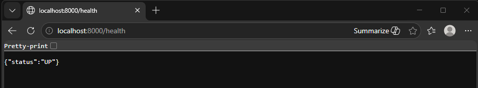
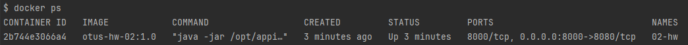

# Docker образ

## Задание

Создать минимальный сервис, который:
- Отвечает на порту 8000
- Имеет HTTP метод: `GET /health/` → `{"status": "OK"}`


Cобрать локально образ приложения в докер контенер под архитектуру AMD64.

* Запушить образ в dockerhub
* На выходе необходимо предоставить
  * имя репозитория и тэг на Dockerhub
  * ссылку на github c Dockerfile, либо приложить Dockerfile в ДЗ

## Dockerfile

```bash
FROM maven:3.9.6-eclipse-temurin-21-alpine AS builder
WORKDIR /app
COPY .. /app/.
RUN mvn -f /app/pom.xml clean package -Dmaven.test.skip=true

FROM eclipse-temurin:21-jre-alpine
WORKDIR /app
COPY --from=builder /app/simple-service/target/simple-service-*.jar /opt/appication.jar
EXPOSE 8000
ENTRYPOINT ["java", "-jar", "/opt/appication.jar"]
```

## Сборка и запуск образа
```text
docker build --platform linux/amd64 -t kornakovkv/otus-hw02:v1 -f simple-service/Dockerfile .

docker run -d -p 8000:8080 --name home-work-02 kornakovkv/otus-hw02:v1
```

## Проверка


#### Проверяем контейнер
```bash
docker ps
```


## Публикация образа в dockerhub
```bash
docker login
docker push kornakovkv/otus-hw02:v1
```
## Скачивание образа
```bash
docker pull kornakovkv/otus-hw02:v1
```

## API

| Method | Path | Response |
|--------|------|----------|
| GET | /health/ | `{"status": "OK"}` |
